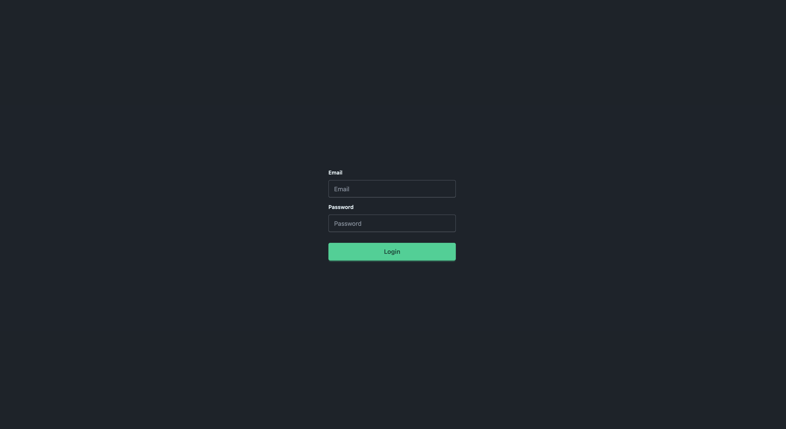
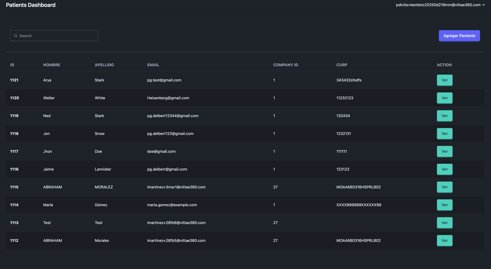
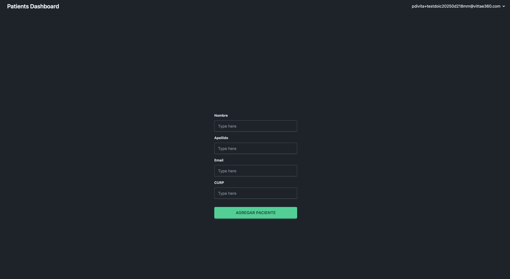
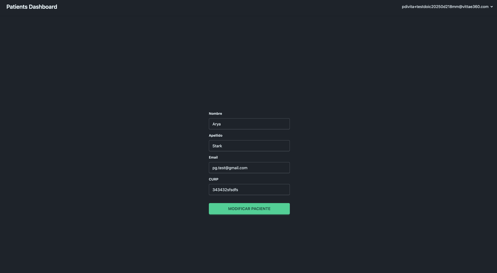
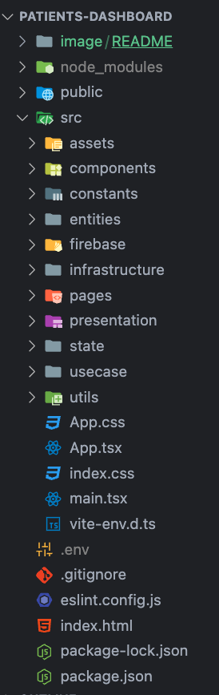

# Patients Dashboard

---

Instalación de dependencias y ejecución.

```
npm i && npm run dev
```

Se debe de agregar el `.env` con las variables de entorno requeridas para conectarse con `firebase`

---

# Vistas

Login



Lista de pacientes



Agregar Paciente



Modificar datos de paciente



---

## Estructura de la aplicación


